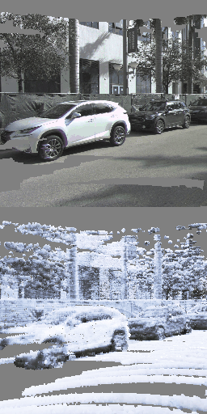
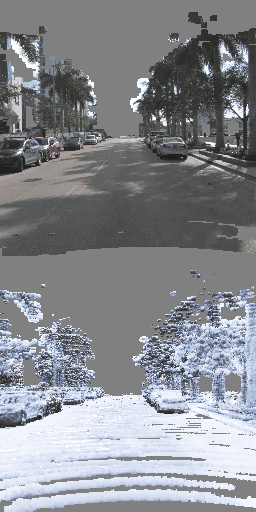
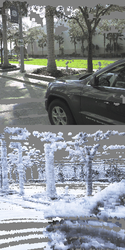
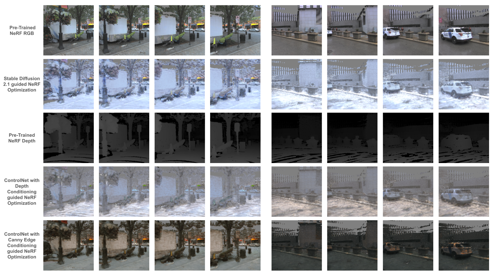

# Adaptive Street View

We explore the application of Neural Radiance Fields to generate novel street views, similar to the likes of Google Street View but without the need for special data acquisition and curation by leveraging the vast and open-source self-driving datasets like Argoverse2. To address the challenges posed by sparse camera views and biased straight line trajectories of the viewpoints in these datasets we use LiDAR maps as depths priors to help the NeRF model converge faster while also learning point embeddings for each location of the LiDAR point cloud. Furthermore, we propose diffusion guided optimization to modify these embeddings allowing us to render custom textures in the scene from user-defined prompts while maintaining geometric consistency across views. We test our approach on the Argoverse2 dataset and provide a qualitative as well as a quantitative comparison of the rendered scene against the ground truth images

| **Left View**   |  **Front View**                         |**Right View**                         |
|:------------------------|:------------------------------------|:------------------------------------|
|  |   |  |

## Run Instructions

```bash
python3 train.py --name_data=clean --name_config=config.ini --exp_name_prefix="vanilla_seq_ablations_1_guide70" --text_prompt="streets covered in snow" --guidance_scale=70 --sd_model="2.1" --controlnet_input="None" --seq_id="seq1"
```

## Results

### ControlNet Comparisons



### Guidance Ablations

